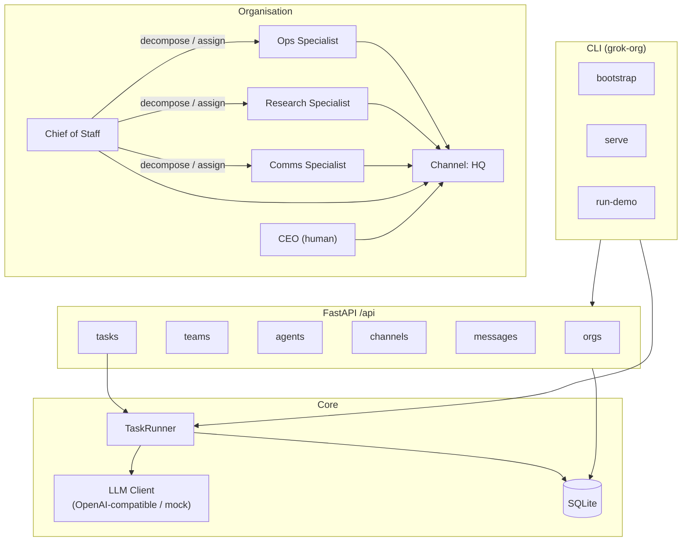

# Grok Org OS

Portable multi-agent AI organization platform. Model an organisation with a human CEO, an AI Chief of Staff, specialist teams (Ops / Research / Comms), channels, messages, and tasks — then run collaboration end-to-end via FastAPI or the `grok-org` CLI.

## Quick start

```bash
cd Grok  # or clone path
python -m venv .venv && source .venv/bin/activate
pip install -e ".[dev]"

# Sample org (CEO human, CoS, Ops/Research/Comms)
grok-org bootstrap

# End-to-end collaboration demo (mock LLM if no API key)
grok-org run-demo

# API server — Swagger UI at http://127.0.0.1:8000/docs
grok-org serve
```

Tests:

```bash
pytest -q
```

Docker:

```bash
docker compose up --build
# http://localhost:8000/docs
```

## Architecture



### Task flow

1. A task is created and **assigned** (often to the Chief of Staff).
2. CoS calls the LLM to **decompose** work, creates subtasks, and assigns specialists.
3. Each specialist calls the LLM and **posts results** to the channel.
4. CoS **synthesizes** an executive summary; status becomes `done`.
5. **Handoff** moves a task to another agent (`handed_off` → `assigned`).

Task statuses: `pending` → `assigned` → `in_progress` → (`handed_off`) → `done` | `failed`.

## Environment variables

| Variable | Default | Description |
|----------|---------|-------------|
| `OPENAI_API_KEY` | _(empty)_ | If unset, mock LLM responses are used |
| `OPENAI_BASE_URL` | `https://api.openai.com/v1` | OpenAI-compatible base URL |
| `OPENAI_MODEL` | `gpt-4o-mini` | Model name for `/chat/completions` |
| `DATABASE_URL` | `sqlite:///./grok_org_os.db` | SQLAlchemy URL |
| `HOST` | `0.0.0.0` | Server bind host |
| `PORT` | `8000` | Server bind port |

Copy `.env.example` to `.env` and adjust as needed.

## API

- OpenAPI JSON: `/openapi.json`
- Swagger UI: `/docs`
- Health: `/health`
- CRUD under `/api/orgs`, `/api/teams`, `/api/agents`, `/api/channels`, `/api/messages`, `/api/tasks`
- Task actions: `POST /api/tasks/{id}/assign`, `/handoff`, `/run`

## License

MIT
