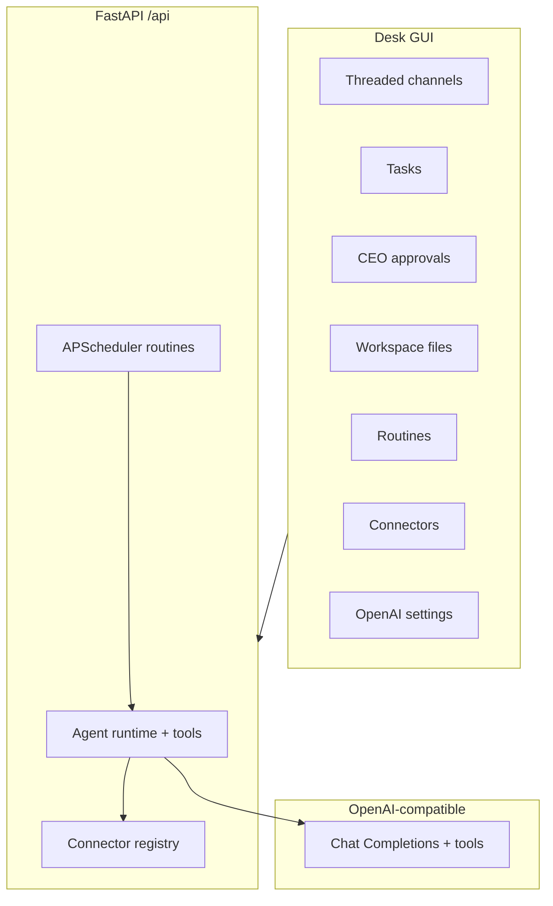

# Grok Org OS 2.0 — Full Power

Portable multi-agent AI organisation platform with **real OpenAI tool calling**, concurrent agent workers, connectors (files / web / email / REST), CEO approvals, workspace file drops, and scheduled routines.

The **PC / Windows app is first-class** (double-click `Start.bat`). Android APK is a standalone on-device mirror of the same desk UI + API.

---

## Windows (double-click) — recommended

**Requirement:** [Python 3.11+](https://www.python.org/downloads/) on PATH  
(check *“Add python.exe to PATH”* during install).

1. Unzip / clone this folder anywhere on your PC.
2. Double-click **`Start.bat`** (or right-click **`Start.ps1`** → Run with PowerShell).
3. Browser / desktop window opens **http://127.0.0.1:8000** — the full desk GUI.
4. Click **⚙ OpenAI** → paste your `OPENAI_API_KEY`, optional base URL / model → **Test connection** → **Save**.
5. Hit **Run Demo** — with a key set, agents use **live tool calls** (messages, tasks, web/files). Without a key, offline **mock** tool calling still demos the flow.
6. Stop: close the console, or run **`Stop.bat`**.

First launch creates `.venv`, installs deps (including APScheduler), copies `.env.example` → `.env`, creates `workspace/`, and bootstraps a sample org.

### Full power on Windows (OpenAI)

| Setting | Default | Notes |
|---------|---------|--------|
| `OPENAI_API_KEY` | _(empty = mock)_ | Required for live LLM + real tools |
| `OPENAI_BASE_URL` | `https://api.openai.com/v1` | OpenRouter / Azure / Ollama compatible |
| `OPENAI_MODEL` | `gpt-4o-mini` | Any chat-completions model with tools |

Also editable in the GUI **OpenAI** dialog (saved to `.env`).

Optional connectors in `.env`: `SMTP_*`, `WEBHOOK_URL`, `REST_*`, `GOOGLE_*` (stubs activate when tokens present).

---

## Mac / Linux

```bash
chmod +x start.sh
./start.sh
# → http://127.0.0.1:8000
```

Or:

```bash
python3 -m venv .venv && source .venv/bin/activate
pip install -e ".[dev]"
cp -n .env.example .env   # set OPENAI_API_KEY for live mode
grok-org serve
```

---

## What you get (v2.0)

| Surface | URL |
|---------|-----|
| **Desk GUI** | http://127.0.0.1:8000/ |
| Swagger / OpenAPI | http://127.0.0.1:8000/docs |
| Health | http://127.0.0.1:8000/health |

### Full power features

1. **Real LLM + tool calling** — OpenAI Chat Completions with functions: `send_message`, `create_task`, `handoff_task`, `read_channel`, `list_agents`, `http_fetch`, `fs_list` / `fs_read` / `fs_write`, `request_approval`.
2. **True multi-agent workers** — concurrent thread-pool workers + background poller; Chief of Staff orchestrates; specialists execute tools; CEO is human.
3. **Connectors** — Files (workspace), Web (httpx), SMTP email, outbound webhook, generic REST, Google mail/calendar/chat stubs.
4. **Richer desk UX** — threaded replies, approvals inbox, file drop, agent status (idle/thinking/tool), routines panel, OpenAI settings + Test connection.
5. **Routines** — cron / interval scheduler (APScheduler), persisted in SQLite, fires while server runs.
6. **Approvals** — agents pause via `request_approval`; CEO approves/rejects in UI.

CLI:

```bash
grok-org bootstrap
grok-org run-demo
grok-org serve
grok-org desktop    # optional native window
pytest -q
```

---

## Android standalone

APK under `android/dist/GrokOrgOS-2.0.0-debug.apk` — on-device NanoHTTPD backend + same desk UI. Set OpenAI key in in-app Settings. Rebuild:

```bash
cd android && ./build-apk.sh
```

---

## Docker (optional)

```bash
docker compose up --build
```

---

## Architecture



## Tests

```bash
pip install -e ".[dev]"
pytest -q
```

Covers tool calling (mocked OpenAI HTTP), multi-agent demo, approval flow, routine CRUD/fire, file upload, connectors, threaded replies.

## License

MIT
