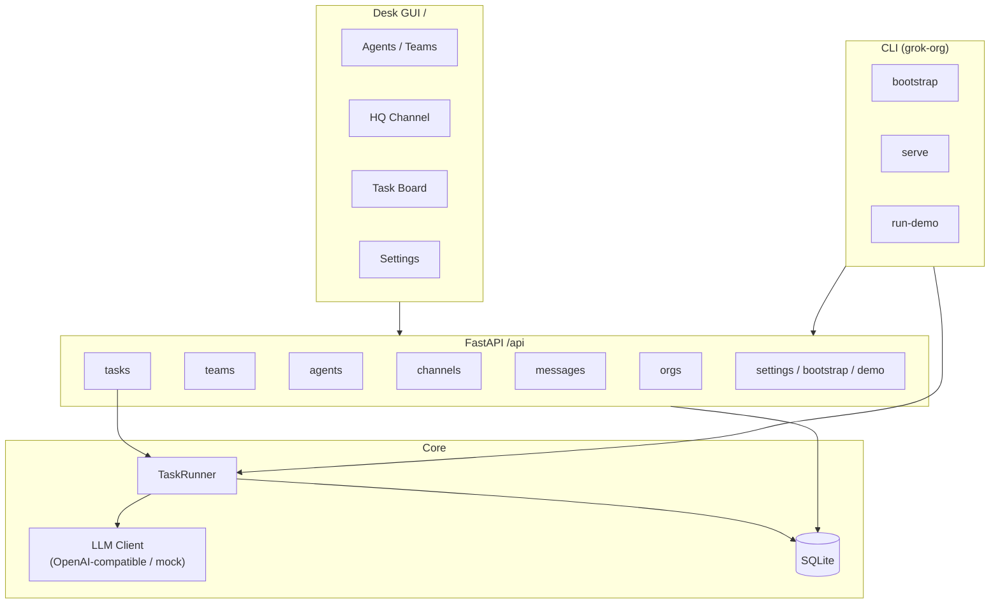

# Grok Org OS

Portable multi-agent AI organization platform with a **full desk-style GUI**. Model an organisation with a human CEO, an AI Chief of Staff, specialist teams (Ops / Research / Comms), channels, messages, and tasks — then run collaboration end-to-end.

## Windows (double-click)

**Requirement:** [Python 3.11+](https://www.python.org/downloads/) installed and on PATH  
(check *“Add python.exe to PATH”* during install). No Docker or Node required.

1. Unzip / clone this folder anywhere.
2. Double-click **`Start.bat`** (or right-click **`Start.ps1`** → Run with PowerShell).
3. A browser opens to **http://127.0.0.1:8000** with the desk GUI.
4. To stop: close the console window, or run **`Stop.bat`**.

First launch creates `.venv`, installs dependencies, copies `.env.example` → `.env`, and auto-bootstraps a sample org if the database is empty.

Optional: open **Settings** in the GUI to set an OpenAI-compatible API key, base URL, and model (saved to `.env`). Leave the key empty to use the offline mock LLM.

## Mac / Linux

```bash
chmod +x start.sh
./start.sh
# → http://127.0.0.1:8000
```

Or manually:

```bash
python3 -m venv .venv && source .venv/bin/activate
pip install -e ".[dev]"
grok-org serve
```

## What you get

| Surface | URL |
|---------|-----|
| **Desk GUI** (agents, HQ channel, tasks, settings) | http://127.0.0.1:8000/ |
| Swagger / OpenAPI | http://127.0.0.1:8000/docs |
| Health | http://127.0.0.1:8000/health |

GUI features:

- Sidebar of agents / teams (CEO, Chief of Staff, Ops, Research, Comms)
- Channel / conversation view with live-ish polling
- Task board (create, status, run)
- Agent persona panels
- **Run Demo** collaboration button
- Settings for OpenAI-compatible API (base URL, key, model)

CLI extras:

```bash
grok-org bootstrap          # sample org
grok-org run-demo           # end-to-end collaboration (mock LLM ok)
grok-org serve              # API + GUI (opens browser)
grok-org desktop            # optional native window (pip install -e ".[desktop]")
pytest -q
```

Portable launchers at repo root: `Start.bat` / `Start.ps1` / `Stop.bat` (Windows) and `start.sh` (Mac/Linux). Copy the folder anywhere — it is the app.


## Docker (optional)

```bash
docker compose up --build
# http://localhost:8000/
```

## Architecture



### Task flow

1. A task is created and **assigned** (often to the Chief of Staff).
2. CoS calls the LLM to **decompose** work, creates subtasks, and assigns specialists.
3. Each specialist calls the LLM and **posts results** to the channel.
4. CoS **synthesizes** an executive summary; status becomes `done`.
5. **Handoff** moves a task to another agent (`handed_off` → `assigned`).

Task statuses: `pending` → `assigned` → `in_progress` → (`handed_off`) → `done` | `failed`.

## Environment variables

| Variable | Default | Description |
|----------|---------|-------------|
| `OPENAI_API_KEY` | _(empty)_ | If unset, mock LLM responses are used |
| `OPENAI_BASE_URL` | `https://api.openai.com/v1` | OpenAI-compatible base URL |
| `OPENAI_MODEL` | `gpt-4o-mini` | Model name for `/chat/completions` |
| `DATABASE_URL` | `sqlite:///./grok_org_os.db` | SQLAlchemy URL |
| `HOST` | `0.0.0.0` | Server bind host |
| `PORT` | `8000` | Server bind port |

Copy `.env.example` to `.env` and adjust as needed (or use the Settings panel).

## API

- OpenAPI JSON: `/openapi.json`
- Swagger UI: `/docs`
- Health: `/health`
- Desk UI: `/`
- CRUD under `/api/orgs`, `/api/teams`, `/api/agents`, `/api/channels`, `/api/messages`, `/api/tasks`
- Task actions: `POST /api/tasks/{id}/assign`, `/handoff`, `/run`
- System: `GET/PUT /api/settings`, `POST /api/bootstrap`, `POST /api/demo`

## License

MIT
